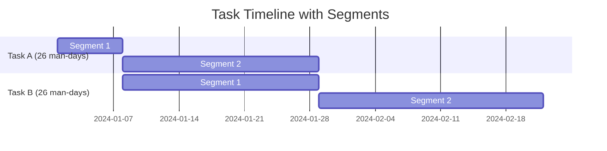
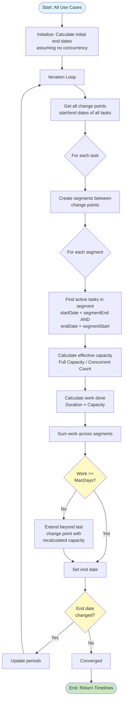
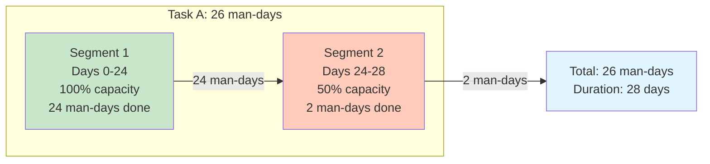
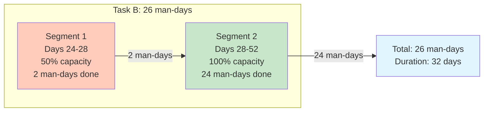

# Timeline Calculation Explanation

## Overview

The timeline calculation uses a **segment-based approach** to accurately account for partial overlaps where tasks start and end at different times. This ensures that developers get full capacity when working on a single task, and capacity splits proportionally only during actual overlap periods.

## How It Works

### Step 1: Identify Concurrency Change Points

All start and end dates from all use cases are collected and sorted. These become the boundaries where concurrency changes.

```
Change Points = [Task A Start, Task B Start, Task A End, Task B End, ...]
```

### Step 2: Break Each Task Into Segments

Each task is divided into segments where concurrency is constant. A segment represents a period between two change points.

### Step 3: Calculate Capacity Per Segment

For each segment, determine which tasks are active and calculate effective capacity:
- **Effective Capacity** = Full Capacity / Number of Concurrent Tasks
- Only tasks that are active during the ENTIRE segment period are considered

### Step 4: Calculate Work Done Per Segment

Work done in a segment = (Segment Duration in Working Days) × (Effective Capacity)

### Step 5: Sum Segments to Get Total Duration

Continue adding segments until total work done >= required man-days. The end date is calculated when this condition is met.

## Visual Example



## Detailed Calculation Flow



## Example Scenario

### Setup
- **Task A**: 26 man-days, starts Day 0, 3 developers (each 40 hrs/week)
- **Task B**: 26 man-days, starts Day 24, same 3 developers

### Calculation for Task A



**Task A Calculation:**
- **Segment 1 (Days 0-24)**: 
  - Only Task A active → 100% capacity
  - Capacity: 3 devs × (40 hrs/week ÷ 5 days) ÷ 8 = 3 man-days/day
  - Work done: 24 working days × 3 = 24 man-days
- **Segment 2 (Days 24-28)**:
  - Tasks A + B active → 50% capacity
  - Capacity: 3 devs × (40 hrs/week ÷ 5 days) ÷ 2 ÷ 8 = 1.5 man-days/day
  - Work needed: 26 - 24 = 2 man-days
  - Duration: 2 ÷ 1.5 = 1.33 → 2 working days (rounded up)
  - Work done: 2 man-days
- **Total**: 24 + 2 = 26 man-days in 28 working days

### Calculation for Task B



**Task B Calculation:**
- **Segment 1 (Days 24-28)**:
  - Tasks A + B active → 50% capacity
  - Capacity: 1.5 man-days/day
  - Work done: 4 working days × 1.5 = 6 man-days (but only needs 2 more to complete overlap period)
  - Actually: 2 man-days done (matching Task A's remaining work)
- **Segment 2 (Days 28+)**:
  - Task A finished → 100% capacity
  - Capacity: 3 man-days/day
  - Work needed: 26 - 2 = 24 man-days
  - Duration: 24 ÷ 3 = 8 working days
  - Work done: 24 man-days
- **Total**: 2 + 24 = 26 man-days in 32 working days

## Key Principles

1. **Segments have constant concurrency**: Within a segment, the set of active tasks doesn't change
2. **Capacity splits proportionally**: If N tasks share developers, each gets 1/N capacity
3. **Full capacity when alone**: Before other tasks start or after they end, tasks get 100% capacity
4. **Working days only**: All calculations exclude weekends
5. **Iterative refinement**: As end dates change, segments are recalculated until stable

## Capacity Calculation Formula

For a developer working on multiple concurrent tasks:

```
Daily Capacity = (Weekly Hours ÷ 5 working days) ÷ 8 hours per man-day
Effective Capacity = Daily Capacity ÷ Number of Concurrent Tasks
```

Example: 3 developers, 40 hrs/week each, working on 2 concurrent tasks:
- Daily capacity per dev: 40 ÷ 5 = 8 hrs/day = 1 man-day/day
- Total daily capacity: 3 × 1 = 3 man-days/day
- Effective capacity per task: 3 ÷ 2 = 1.5 man-days/day

## Segment Activity Check

A task is considered **active in a segment** if:
```
task.startDate < segmentEnd AND task.endDate > segmentStart
```

This strict inequality ensures:
- Tasks that end exactly at segment start are NOT included
- Tasks that start exactly at segment end are NOT included
- Only tasks active during the segment period are counted

## Why This Matters

**Without segment-based calculation:**
- Task A: 26 man-days, treated as 50% capacity for entire duration → 52 days
- Task B: 26 man-days, treated as 50% capacity for entire duration → 52 days

**With segment-based calculation:**
- Task A: 24 days at 100% + 4 days at 50% → 28 days ✅
- Task B: 4 days at 50% + 24 days at 100% → 32 days ✅

The difference is significant: Task B completes in 32 days instead of 52 days because it gets full capacity after Task A finishes!

